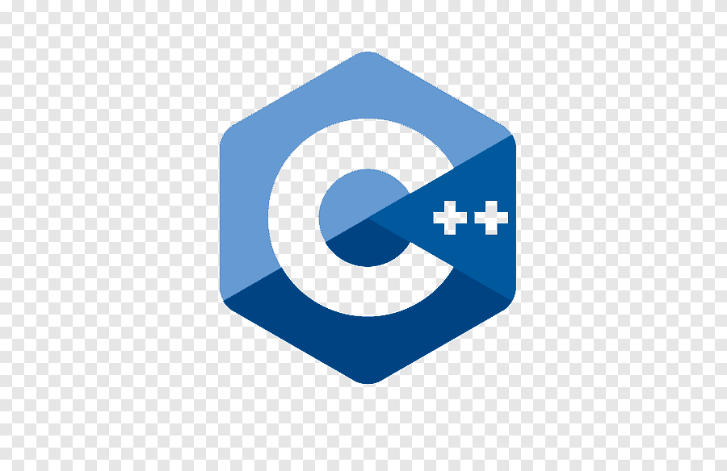

- 👋 Hi, I’m @VedanshPundir
- 👀 I’m interested in Cyber Security and Software Development.
- 🌱 I’m currently learning advanced concepts in Cyber Security and working on projects involving Java, C++, and network scanning tools.
- 💞️ I’m looking to collaborate on projects related to Cyber Security, Java Development, and open-source initiatives.
- 📫 How to reach me: You can contact me via email at vedanshpundir43@gmail.com or connect with me on [LinkedIn](https://www.linkedin.com/in/vedansh-pundir-03129524a/).
- 😄 Pronouns: He/Him
- ⚡ Fun fact: I enjoy exploring concepts of DSA, reading about international relations, and am a fan of basketball and badminton!

<<<<<<< HEAD
## 🧑‍💻 Programming Languages

  

<!---
VedanshPundir/VedanshPundir is a ✨ special ✨ repository because its `README.md` (this file) appears on your GitHub profile.
You can click the Preview link to take a look at your changes.
--->
